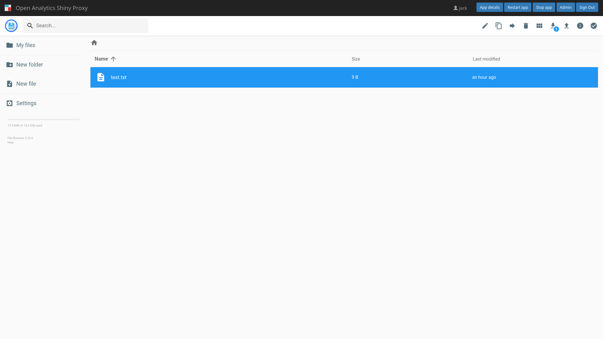

# Running a file-browser inside ShinyProxy

[Screenshot](#screenshot)

ShinyProxy can run a [Go-based file-browser](https://github.com/filebrowser/filebrowser)
using their [official Docker images](https://hub.docker.com/r/filebrowser/filebrowser).

## Volume Configuration

Before starting the file-browser, a directory must be available which will be
mounted into the container. The file-browser shows only this directory to the
user.

In order to use this example, execute the following commands to prepare a
directory:

```bash
mkdir /tmp/filebrowser-demo/
sudo chown -R 1000:1000 /tmp/filebrowser-demo/
```

## Building the Docker image

To pull the image made in this repository from Docker Hub, use

```bash
sudo docker pull openanalytics/shinyproxy-filebrowser
```

Some modifications are required to make the Docker image work in ShinyProxy. To
build the image from the Dockerfile, navigate into the root directory of this
repository and run:

```bash
sudo docker build -t openanalytics/shinyproxy-filebrowser .
```

**Note:** this Docker image contains a `settings.json` file that disable some
features of the file-browser, such as terminal access.

## ShinyProxy Configuration

Create a ShinyProxy configuration file (see [application.yml](application.yml)
for a complete file)

```yaml
- id: filebrowser
  displayName: File Browser
  containerImage: openanalytics/shinyproxy-filebrowser
  port: 80
  container-volumes: [ "/tmp/filebrowser-demo:/mnt" ]
  container-env:
    ROOT_PATH: "/mnt"
    PUID: "1000"
    PGID: "1000"
```

**Note**: the `PUID` and `PGID` variables should be changed to match the owner
and group of the mounted directory respectively.

On Kubernetes a PVC can be mounted, for example using [EFS](https://aws.amazon.com/efs/):

```yaml
- id: filebrowser
  displayName: File Browser
  containerImage: openanalytics/shinyproxy-filebrowser
  port: 80
  container-env:
    ROOT_PATH: "/srv/Shared"
    PUID: "1000"
    PGID: "1000"
    kubernetes-pod-patches: |
      - op: add
        path: /spec/volumes
        value:
          - name: shared
            persistentVolumeClaim:
              claimName: "sp-shared-pvc-efs-#{oidcUser.attributes['sub']}"
      - op: add
        path: /spec/containers/0/volumeMounts
        value:
          - mountPath: "/srv/Shared"
            name: shared
    kubernetes-additional-persistent-manifests:
      - |
        apiVersion: v1
        kind: PersistentVolumeClaim
        metadata:
          name: "sp-shared-pvc-efs-#{oidcUser.attributes['sub']}"
          annotations:
            openanalytics.eu/sp-user-id: #{proxy.getRuntimeValue('SHINYPROXY_USERNAME')}
            openanalytics.eu/sp-additional-manifest-policy: Patch
        spec:
          persistentVolumeReclaimPolicy: Retain
          storageClassName: efs-sc
          accessModes:
            - ReadWriteMany
          resources:
            requests:
              storage: 1Gi # Note this size does not matter, since EFS is an "elastic" file system it does not have a maximum size
```

## Screenshot



**(c) Copyright Open Analytics NV, 2023.**
